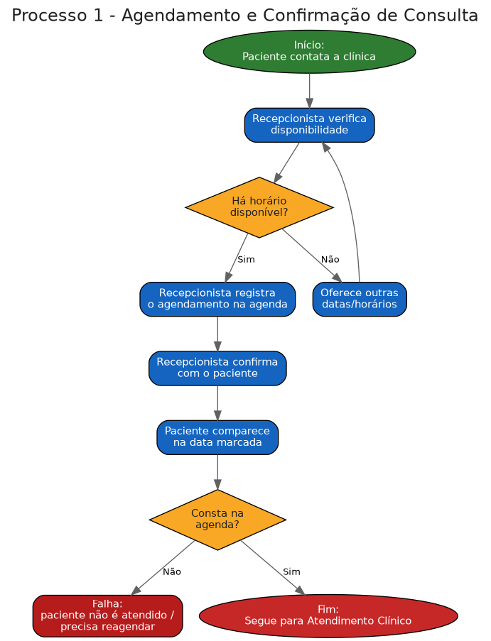
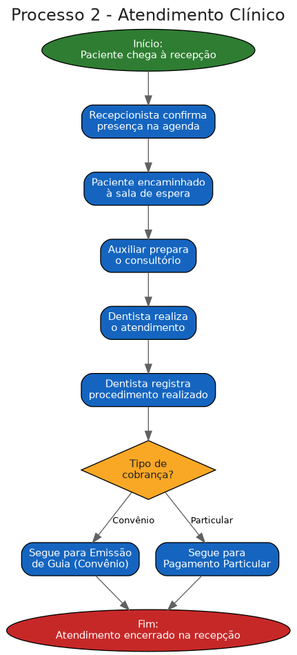
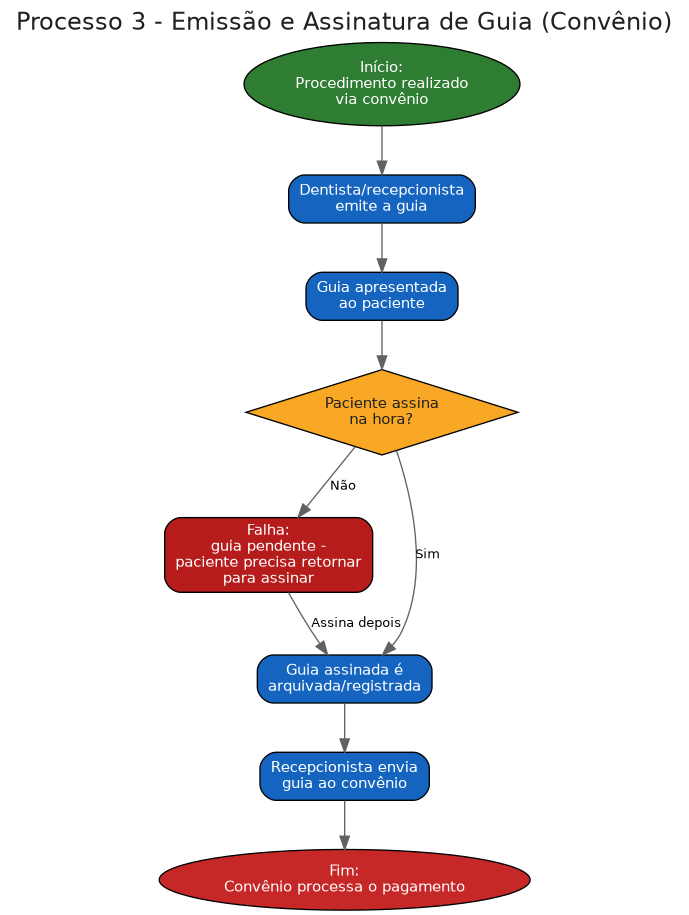
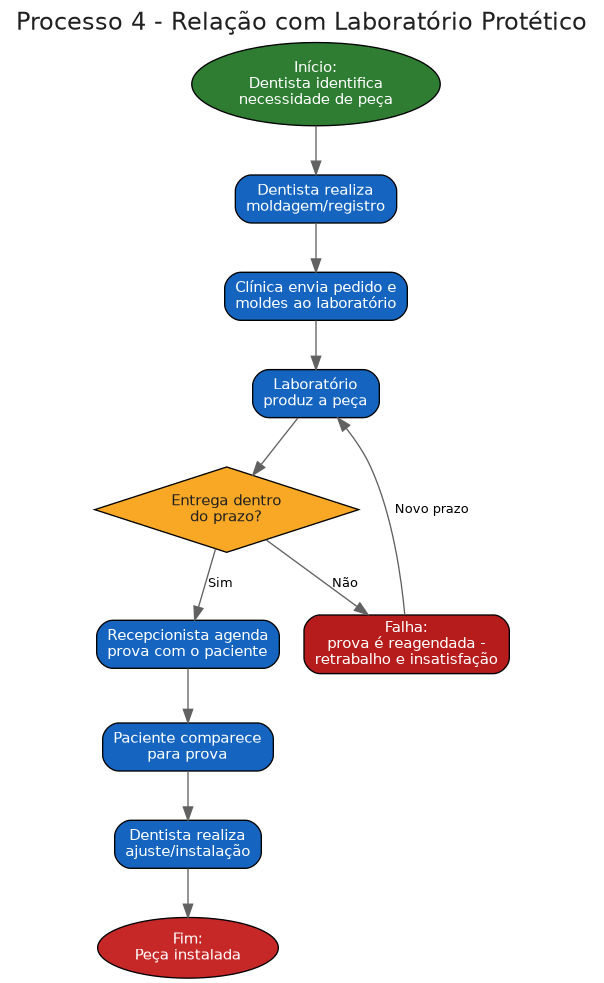
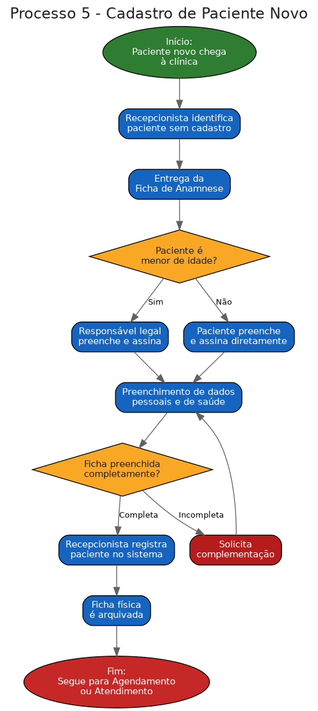
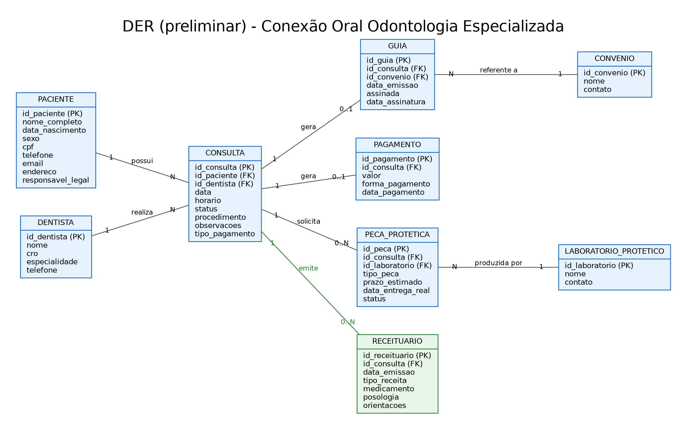

# Entrega 1 — Modelo Conceitual (DER)
### Modelagem de um sistema de gestão de informações para uma organização de pequeno porte

---

## 1. Caracterização da Organização

- **Nome e natureza da organização:** Conexão Oral — Odontologia Especializada, clínica odontológica com fins lucrativos, localizada em São Paulo/SP.

- **Contexto e porte:** A clínica atende tanto pacientes particulares quanto por convênio, sendo a maior parte do atendimento particular. Atualmente conta com 8 dentistas atuando em diferentes especialidades (ortodontia, endodontia, implantodontia, harmonização orofacial (HOF), prótese, periodontia e dentística), além de uma recepcionista, duas auxiliares de dentista e uma profissional de limpeza (que atua às segundas, quartas e sextas-feiras). O volume médio de atendimento é de 150 a 200 pacientes por mês, entre particulares e convênios. A clínica funciona de segunda a sexta-feira, das 8h às 18h.

- **Problemas e necessidades identificados:**
  - Falhas na comunicação entre confirmação de consulta e agendamento: pacientes confirmam a consulta por telefone/mensagem, mas a recepcionista não registra o agendamento na agenda, causando situações em que o paciente comparece à clínica e não é atendido por falta de registro.
  - Desorganização no processo de emissão e assinatura de guias: as guias são emitidas, mas os pacientes muitas vezes esquecem de assiná-las no momento da consulta, sendo necessário retornar à clínica apenas para isso, o que atrasa o envio para pagamento/convênio.
  - Atrasos na comunicação com laboratórios protéticos: não há controle formal do prazo de entrega das peças protéticas, resultando em casos em que o paciente comparece à clínica para prova, mas a peça ainda não chegou.

- **Justificativa da escolha:** A organização foi escolhida por acesso direto e facilitado à pesquisa de campo, já que um dos integrantes do grupo (Guilherme) trabalha na clínica, o que possibilita entrevistas com os responsáveis e observação real dos processos internos (agendamento, atendimento, emissão de guias e relação com laboratórios protéticos). Além disso, o porte da clínica — com múltiplos profissionais, especialidades, tipos de atendimento (particular/convênio) e processos operacionais distintos — gera volume e complexidade suficientes para a modelagem conceitual, sem ser inviável para esta etapa do curso.

- **Evidências da organização:**
  - Nome: Conexão Oral — Odontologia Especializada
  - Localização: Condomínio Edifício Waled Office Tower — R. Coelho Lisboa, 61, Sl 26, Cidade Mãe do Céu, São Paulo - SP, CEP 03323-040
  - Telefone: (11) 93148-6400
  - Horário de funcionamento: Segunda a sexta-feira, das 8h às 18h
  - Instagram: https://www.instagram.com/conexaoral
  - Google Maps: https://maps.app.goo.gl/yEyMq8viZV71aAuk8
  - Fotos da visita: recepção da clínica e consultório odontológico (anexadas ao repositório)

---

## 2. Processos de Negócio

### 2.1 Principais processos mapeados

Foram identificados 5 processos-chave na rotina da Conexão Oral, integrados entre si (o cadastro alimenta o agendamento, que alimenta o atendimento, que pode gerar emissão de guia ou encaminhamento a laboratório protético):

**Processo 1 — Agendamento e Confirmação de Consulta**
1. Paciente entra em contato com a clínica solicitando ou confirmando consulta.
2. Recepcionista verifica disponibilidade de horário/dentista.
3. Se não há horário disponível, oferece outras datas e repete a verificação; se há, segue.
4. Recepcionista registra o agendamento na agenda (ponto de falha atual: esse passo às vezes é esquecido).
5. Recepcionista confirma o agendamento com o paciente.
6. Paciente comparece à clínica na data marcada.
7. Se o agendamento não consta na agenda, o paciente não é atendido e precisa reagendar (falha atual); se consta, segue para o Atendimento Clínico.

**Processo 2 — Atendimento Clínico**
1. Paciente chega à recepção.
2. Recepcionista confirma presença e localiza o agendamento.
3. Paciente é encaminhado à sala de espera; auxiliar prepara o consultório.
4. Dentista realiza o atendimento e registra o procedimento executado.
5. Se o atendimento for por convênio, segue para Emissão e Assinatura de Guia; se particular, segue para pagamento particular.
6. Atendimento é encerrado na recepção.

**Processo 3 — Emissão e Assinatura de Guia (Convênio)**
1. Dentista/recepcionista emite a guia do procedimento realizado.
2. Guia é apresentada ao paciente para assinatura.
3. Se o paciente não assina no momento, a guia fica pendente e ele precisa retornar à clínica apenas para isso (falha atual); se assina, segue.
4. Guia assinada é arquivada/registrada pela recepção e enviada ao convênio.
5. Convênio processa o pagamento à clínica.

**Processo 4 — Relação com Laboratório Protético**
1. Dentista identifica necessidade de peça protética e realiza a moldagem/registro.
2. Clínica envia o pedido e os moldes ao laboratório, com prazo estimado de entrega.
3. Laboratório produz a peça.
4. Se a entrega não ocorre dentro do prazo, a prova é reagendada (falha atual, gera retrabalho e insatisfação); se ocorre, segue.
5. Recepcionista agenda a prova com o paciente, que comparece à clínica.
6. Dentista realiza o ajuste/instalação da peça.

**Processo 5 — Cadastro de Paciente Novo**
1. Paciente chega à clínica pela primeira vez, sem cadastro prévio.
2. Recepcionista entrega a Ficha de Anamnese para preenchimento.
3. Se o paciente é menor de idade, o responsável legal preenche e assina por ele; caso contrário, o próprio paciente preenche e assina.
4. Paciente preenche dados pessoais (nome, nascimento, CPF/RG, endereço, contato, profissão, estado civil) e dados de saúde (histórico médico, alergias, medicações, condições preexistentes).
5. Recepcionista confere se a ficha está completa; se não estiver, solicita complementação.
6. Recepcionista registra o paciente no sistema e a ficha física é arquivada.
7. Paciente segue para o Agendamento (se ainda não tiver consulta marcada) ou direto para o Atendimento Clínico.

### 2.2 Fluxogramas

Os fluxogramas dos 5 processos acima estão anexados ao repositório na pasta `/fluxogramas`:

- `fluxogramas/fluxo1_agendamento.png`
- `fluxogramas/fluxo2_atendimento.png`
- `fluxogramas/fluxo3_guia.png`
- `fluxogramas/fluxo4_protetico.png`
- `fluxogramas/fluxo5_cadastro.png`

---

## 3. Requisitos do Sistema

### 3.1 Requisitos Funcionais

- **RF01:** O sistema deve permitir cadastrar um novo paciente com dados pessoais e de saúde (com base na Ficha de Anamnese).
- **RF02:** O sistema deve permitir registrar um responsável legal para pacientes menores de idade.
- **RF03:** O sistema deve permitir agendar uma consulta, vinculando paciente, dentista, data e horário.
- **RF04:** O sistema deve permitir confirmar um agendamento e registrar essa confirmação de forma visível para a recepção.
- **RF05:** O sistema deve permitir registrar o atendimento clínico realizado (procedimento, observações, dentista responsável).
- **RF06:** O sistema deve permitir emitir uma guia de convênio vinculada a um atendimento.
- **RF07:** O sistema deve permitir registrar a assinatura do paciente na guia, incluindo a data da assinatura.
- **RF08:** O sistema deve permitir registrar o envio da guia ao convênio e o status desse envio.
- **RF09:** O sistema deve permitir registrar pagamentos particulares vinculados a um atendimento.
- **RF10:** O sistema deve permitir registrar a solicitação de peça protética a um laboratório, com prazo estimado de entrega.
- **RF11:** O sistema deve permitir atualizar o status da peça protética (solicitada, em produção, entregue, atrasada).
- **RF12:** O sistema deve permitir agendar a prova/entrega de peça protética com o paciente.
- **RF13:** O sistema deve permitir consultar o histórico de atendimentos de um paciente específico.
- **RF14:** O sistema deve permitir visualizar a agenda por dentista e por especialidade.
- **RF15:** O sistema deve permitir gerar relatórios de atendimentos por período, por dentista e por tipo de pagamento (particular/convênio).

### 3.2 Requisitos Não Funcionais

- **RNF01 (Segurança/Privacidade):** O sistema deve garantir a confidencialidade dos dados de saúde dos pacientes, em conformidade com a LGPD, já que envolve dados sensíveis (histórico médico, alergias, condições de saúde).
- **RNF02 (Disponibilidade):** O sistema deve estar disponível durante o horário de funcionamento da clínica (segunda a sexta, das 8h às 18h), sem indisponibilidades que impactem o agendamento e o atendimento.
- **RNF03 (Usabilidade):** O sistema deve ter interface simples o suficiente para ser operado pela recepcionista e pelas auxiliares sem necessidade de treinamento técnico avançado.
- **RNF04 (Desempenho):** Consultas à agenda e ao histórico de pacientes devem retornar em poucos segundos, mesmo com o volume de 150 a 200 atendimentos/mês.
- **RNF05 (Integridade e Backup):** O sistema deve garantir backup periódico e integridade dos dados de prontuário e ficha de anamnese, evitando perda de informações sensíveis.
- **RNF06 (Controle de Acesso):** O sistema deve prever perfis de acesso distintos (recepção, dentista, administração), restringindo o que cada perfil pode visualizar ou alterar.
- **RNF07 (Auditoria):** O sistema deve manter registro (log) de alterações feitas na agenda, permitindo identificar quem realizou ou modificou um agendamento — mitigando a falha atual de agendamentos não registrados.
- **RNF08 (Escalabilidade):** O sistema deve ser capaz de suportar o crescimento do número de pacientes, dentistas e especialidades sem necessidade de redesenho estrutural.

---

## 4. Regras de Negócio

- **Regras operacionais:**
  - Todo paciente novo deve preencher e assinar a Ficha de Anamnese antes do primeiro atendimento, contendo dados pessoais e de saúde.
  - Caso o paciente seja menor de idade, o responsável legal deve preencher e assinar a ficha em seu lugar.
  - Uma consulta só é considerada válida para atendimento se estiver devidamente registrada na agenda do sistema (regra criada a partir da falha identificada: recepcionista confirma verbalmente, mas não registra, e o paciente não é atendido).
  - Todo atendimento deve estar vinculado a exatamente um paciente e a exatamente um dentista responsável.
  - Uma guia de convênio só pode ser enviada para pagamento após a assinatura do paciente (regra criada a partir da falha identificada de guias não assinadas gerando retrabalho).
  - A prova ou entrega de uma peça protética só deve ser agendada com o paciente após confirmação de que a peça foi efetivamente entregue pelo laboratório (regra criada a partir da falha identificada de atrasos do laboratório).
  - Todo pagamento particular deve ser registrado no momento da finalização do atendimento.
  - Cada peça protética solicitada deve estar vinculada a um único laboratório responsável pela produção.

- **Restrições organizacionais:**
  - A clínica funciona apenas de segunda a sexta-feira, das 8h às 18h, o que restringe os horários possíveis para agendamento no sistema.
  - Dados de saúde dos pacientes são informações sensíveis sujeitas à LGPD, exigindo controle de acesso e sigilo no armazenamento e manuseio.
  - A Ficha de Anamnese física deve ser mantida arquivada pela clínica como respaldo jurídico em caso de intercorrências com o paciente durante o tratamento — essa exigência reforça a necessidade de o sistema também manter esse histórico registrado digitalmente.
  - Convênios podem ter regras próprias de prazo e documentação para processamento de pagamento de guias, o que pode impactar o status de envio/recebimento registrado no sistema.

---

## 5. Dicionário de Dados Conceitual (Preliminar)

> Os exemplos de valores abaixo são fictícios, usados apenas para ilustrar o tipo de dado, e não representam pacientes ou profissionais reais da clínica.

### Entidade: PACIENTE
*(atributos baseados na Ficha de Anamnese da clínica)*

| Atributo | Descrição | Regra de negócio associada |
|----------|-----------|------------------------------|
| id_paciente | Identificador único do paciente | Obrigatório; gerado pelo sistema |
| nome_completo | Nome completo do paciente (ex.: "Maria Souza Lima") | Obrigatório |
| data_nascimento | Data de nascimento do paciente | Obrigatório; usada para determinar se é menor de idade |
| sexo | Sexo do paciente | Obrigatório |
| cpf | CPF do paciente (ex.: "123.456.789-00") | Obrigatório para maiores de idade |
| rg | RG do paciente | Opcional |
| profissao | Profissão do paciente | Opcional |
| estado_civil | Estado civil do paciente | Opcional |
| endereco | Endereço completo (rua, número, complemento, bairro, CEP) | Opcional |
| telefone | Telefone/WhatsApp de contato | Obrigatório, usado para confirmação de consultas |
| email | E-mail de contato | Opcional |
| responsavel_legal | Nome e CPF do responsável legal | Obrigatório apenas se o paciente for menor de idade |
| historico_saude | Respostas da avaliação de saúde (alergias, doenças, medicações, gravidez, etc.) | Obrigatório o preenchimento antes do primeiro atendimento |
| data_cadastro | Data em que o paciente foi cadastrado no sistema | Gerado automaticamente pelo sistema |

### Entidade: DENTISTA

| Atributo | Descrição | Regra de negócio associada |
|----------|-----------|------------------------------|
| id_dentista | Identificador único do dentista | Obrigatório; gerado pelo sistema |
| nome | Nome completo do dentista (ex.: "Dr. João Pereira") | Obrigatório |
| cro | Número de registro profissional (CRO) | Obrigatório, deve ser único |
| especialidade | Especialidade do dentista (ex.: "Ortodontia", "Endodontia", "Implantodontia") | Obrigatório |
| telefone | Telefone de contato profissional | Opcional |

### Entidade: CONSULTA
*(entidade unificada — reúne os dados de agendamento e os dados clínicos do atendimento, já que na prática da clínica esses dois momentos são tratados como um só evento)*

| Atributo | Descrição | Regra de negócio associada |
|----------|-----------|------------------------------|
| id_consulta | Identificador único da consulta | Obrigatório; gerado pelo sistema |
| id_paciente | Paciente vinculado à consulta | Obrigatório (chave estrangeira) |
| id_dentista | Dentista responsável pela consulta | Obrigatório (chave estrangeira) |
| data | Data marcada para a consulta | Obrigatório; deve respeitar o horário de funcionamento (seg-sex, 8h-18h) |
| horario | Horário marcado | Obrigatório; não pode haver conflito de horário para o mesmo dentista |
| status | Situação da consulta (ex.: "confirmada", "realizada", "não compareceu", "cancelada") | Obrigatório; consulta só é considerada válida se estiver registrada na agenda |
| procedimento | Procedimento realizado (ex.: "restauração", "limpeza", "extração") | Preenchido no momento do atendimento |
| observacoes | Observações clínicas do atendimento | Opcional |
| tipo_pagamento | Indica se a consulta é particular ou por convênio | Obrigatório; define se será gerada Guia ou Pagamento |

### Entidade: GUIA

| Atributo | Descrição | Regra de negócio associada |
|----------|-----------|------------------------------|
| id_guia | Identificador único da guia | Obrigatório; gerado pelo sistema |
| id_consulta | Consulta vinculada à guia | Obrigatório (chave estrangeira) |
| id_convenio | Convênio vinculado à guia | Obrigatório (chave estrangeira) |
| data_emissao | Data de emissão da guia | Obrigatório |
| assinada | Indica se o paciente já assinou a guia (sim/não) | Obrigatório; guia só pode ser enviada ao convênio se assinada |
| data_assinatura | Data em que a assinatura foi registrada | Preenchido apenas após assinatura |

### Entidade: CONVENIO

| Atributo | Descrição | Regra de negócio associada |
|----------|-----------|------------------------------|
| id_convenio | Identificador único do convênio | Obrigatório; gerado pelo sistema |
| nome | Nome do convênio (ex.: "Amil Dental", "OdontoPrev") | Obrigatório |
| contato | Telefone/e-mail de contato do convênio | Opcional |

### Entidade: PAGAMENTO

| Atributo | Descrição | Regra de negócio associada |
|----------|-----------|------------------------------|
| id_pagamento | Identificador único do pagamento | Obrigatório; gerado pelo sistema |
| id_consulta | Consulta vinculada ao pagamento | Obrigatório (chave estrangeira) |
| valor | Valor pago pelo paciente | Obrigatório |
| forma_pagamento | Forma de pagamento (ex.: "cartão", "pix", "dinheiro") | Obrigatório |
| data_pagamento | Data em que o pagamento foi realizado | Obrigatório |

### Entidade: PECA_PROTETICA

| Atributo | Descrição | Regra de negócio associada |
|----------|-----------|------------------------------|
| id_peca | Identificador único da peça protética | Obrigatório; gerado pelo sistema |
| id_consulta | Consulta que originou a solicitação da peça | Obrigatório (chave estrangeira) |
| id_laboratorio | Laboratório responsável pela produção | Obrigatório (chave estrangeira) |
| tipo_peca | Tipo de peça solicitada (ex.: "prótese total", "faceta") | Obrigatório |
| prazo_estimado | Data estimada de entrega pelo laboratório | Obrigatório |
| data_entrega_real | Data em que a peça foi efetivamente entregue | Preenchido apenas após entrega |
| status | Situação da peça (ex.: "solicitada", "em produção", "entregue", "atrasada") | Obrigatório; prova só pode ser agendada com status "entregue" |

### Entidade: LABORATORIO_PROTETICO

| Atributo | Descrição | Regra de negócio associada |
|----------|-----------|------------------------------|
| id_laboratorio | Identificador único do laboratório | Obrigatório; gerado pelo sistema |
| nome | Nome do laboratório protético | Obrigatório |
| contato | Telefone/e-mail de contato do laboratório | Opcional |

---

## 6. Modelagem Conceitual (Entidades, Atributos, Relacionamentos)

- **Entidades reconhecidas:**
  - **PACIENTE** — representa a pessoa atendida pela clínica; entidade central do modelo, origem de toda a jornada (cadastro → consulta).
  - **DENTISTA** — representa os 8 profissionais que atuam na clínica, cada um com uma especialidade.
  - **CONSULTA** — representa tanto o agendamento quanto o atendimento clínico em si (data/horário/status e também procedimento/observações/tipo de pagamento). Após validação com o grupo, optou-se por unificar essas informações em uma única entidade, já que na prática da clínica agendar e atender são tratados como uma coisa só, sem separação operacional entre os dois momentos.
  - **GUIA** — representa o documento gerado para consultas via convênio, com controle de assinatura e envio.
  - **CONVENIO** — representa os planos odontológicos com os quais a clínica trabalha.
  - **PAGAMENTO** — representa o registro financeiro de consultas particulares.
  - **PECA_PROTETICA** — representa peças solicitadas a laboratórios externos (próteses, facetas etc.).
  - **LABORATORIO_PROTETICO** — representa os fornecedores externos responsáveis pela produção das peças.

- **Atributos e classificações:** Os atributos de cada entidade estão detalhados no Dicionário de Dados (Seção 5). Em termos de classificação:
  - Todos os identificadores (`id_*`) são atributos **chave primária (PK)**, simples e obrigatórios.
  - Atributos como `endereco` e `responsavel_legal` (em PACIENTE) são **compostos** (agregam múltiplas informações — rua/número/bairro/CEP; nome/CPF do responsável).
  - Atributos como `historico_saude` (em PACIENTE) funcionam como um **atributo composto/multivalorado conceitual**, já que reúne várias respostas da avaliação de saúde da Ficha de Anamnese.
  - Atributos como `status` (em CONSULTA e PECA_PROTETICA) são **atributos de domínio fechado** (um conjunto limitado e pré-definido de valores possíveis).

- **Relacionamentos pertinentes:**
  - PACIENTE **possui** CONSULTA (1:N) — um paciente pode ter várias consultas ao longo do tempo; cada consulta pertence a um único paciente.
  - DENTISTA **realiza** CONSULTA (1:N) — um dentista realiza várias consultas; cada consulta é conduzida por um único dentista.
  - CONSULTA **gera** GUIA (1:0..1) — apenas quando a consulta é via convênio.
  - CONSULTA **gera** PAGAMENTO (1:0..1) — apenas quando a consulta é particular. Confirmado com o grupo: cada consulta gera **exatamente um** desses dois registros (guia OU pagamento), nunca ambos.
  - GUIA **é referente a** CONVENIO (N:1) — várias guias podem pertencer ao mesmo convênio.
  - CONSULTA **solicita** PECA_PROTETICA (1:0..N) — uma consulta pode gerar zero, uma ou várias solicitações de peça (ex.: mais de um dente).
  - PECA_PROTETICA **é produzida por** LABORATORIO_PROTETICO (N:1) — várias peças podem ser produzidas pelo mesmo laboratório.

- **Restrições e políticas organizacionais aplicadas ao modelo:**
  - A unificação de CONSULTA (agendamento + atendimento) reflete a validação do grupo de que, na prática da clínica, esses dois momentos não são tratados separadamente — o campo `status` é o que permite ao sistema acompanhar a evolução da consulta (agendada → confirmada → realizada/faltou/cancelada), mitigando a falha de agendamentos não registrados sem exigir uma entidade adicional.
  - A separação entre GUIA e PAGAMENTO (em vez de uma única entidade "cobrança") reflete a política real da clínica de tratar consultas particulares e por convênio com fluxos e documentações diferentes.
  - O relacionamento opcional (0..1) entre CONSULTA e GUIA/PAGAMENTO modela a regra confirmada de que cada consulta gera apenas um tipo de registro financeiro, nunca os dois.
  - A entidade PECA_PROTETICA guarda `prazo_estimado` e `data_entrega_real` para permitir o controle de atrasos do laboratório, problema apontado como recorrente na organização.

---

## 7. Diagrama Entidade-Relacionamento (DER)

O DER preliminar está anexado ao repositório em `der/DER_conexao_oral.png`, representando as 8 entidades identificadas (PACIENTE, DENTISTA, CONSULTA, GUIA, CONVENIO, PAGAMENTO, PECA_PROTETICA e LABORATORIO_PROTETICO), seus atributos principais (com indicação de chave primária — PK — e chave estrangeira — FK) e os relacionamentos com suas respectivas cardinalidades.

O diagrama já contempla potencial de escalabilidade e integração para as próximas etapas do projeto — por exemplo, novas entidades como "Estoque de Materiais" ou "Funcionário" (recepção, auxiliares, limpeza) podem ser incorporadas ao modelo sem necessidade de reestruturação das entidades já existentes.

---

## 8. Justificativa Técnica

A modelagem partiu diretamente dos processos reais observados na Conexão Oral, das três falhas operacionais relatadas (agendamento não registrado, guias não assinadas, atrasos de laboratório protético) e da validação feita com o grupo sobre como esses eventos realmente acontecem na prática, o que orientou várias decisões de abstração:

- **Unificação de CONSULTA (agendamento + atendimento clínico):** inicialmente havia sido considerada a separação entre uma entidade de agendamento e uma entidade de atendimento clínico, sob a hipótese de que uma consulta marcada nem sempre se converte em atendimento efetivo. Após validação com o grupo, essa hipótese foi descartada: na prática da Conexão Oral, agendar e atender são tratados como um único evento operacional. Por isso, optou-se por uma única entidade CONSULTA, cujo atributo `status` (agendada, confirmada, realizada, não compareceu, cancelada) já é suficiente para acompanhar o ciclo de vida do evento — inclusive para sinalizar o problema real relatado de consultas confirmadas verbalmente, mas não registradas no sistema.

- **Separação entre GUIA e PAGAMENTO em vez de uma entidade genérica "Cobrança":** avaliou-se a alternativa de unificar os dois em uma única entidade com um atributo "tipo". Essa alternativa foi descartada porque GUIA e PAGAMENTO têm atributos e regras de negócio distintos (GUIA depende de CONVENIO e de assinatura; PAGAMENTO depende apenas de forma de pagamento e valor). Manter entidades separadas evita atributos nulos desnecessários (ex.: um pagamento particular nunca teria `id_convenio` ou `assinada` preenchidos) e reflete com mais fidelidade os dois fluxos operacionais observados na clínica.

- **Cardinalidade opcional (0..1) entre CONSULTA e GUIA/PAGAMENTO:** essa escolha foi confirmada com o grupo — uma consulta gera *exatamente um* desses dois registros, nunca ambos e nunca nenhum, refletindo a política real de que toda consulta é ou particular ou por convênio.

- **PECA_PROTETICA como entidade própria, e não como atributo de CONSULTA:** como uma mesma consulta pode gerar mais de uma solicitação de peça (por exemplo, múltiplos dentes trabalhados na mesma consulta), tratar isso como atributo simples de CONSULTA violaria a forma normal (geraria atributo multivalorado). Por isso, criou-se uma entidade separada com relacionamento 1:N, permitindo ainda registrar `prazo_estimado` e `data_entrega_real` — essenciais para dar visibilidade ao problema de atrasos relatado pela clínica.

- **LABORATORIO_PROTETICO e CONVENIO como entidades independentes:** ambos poderiam, em tese, ser modelados como simples atributos de texto (nome do laboratório, nome do convênio) dentro de PECA_PROTETICA e GUIA, respectivamente. Optou-se por entidades próprias porque a clínica trabalha com múltiplos laboratórios e múltiplos convênios de forma recorrente, e essa separação evita redundância de dados (nome/contato repetidos em cada registro) e permite futuras funcionalidades, como relatórios de desempenho por laboratório (ex.: taxa de atraso) ou por convênio.

- **DENTISTA como entidade separada de CONSULTA:** como a clínica tem 8 dentistas com especialidades diferentes, essa separação permite consultas futuras como "agenda por especialidade" (requisito RF14) sem duplicar informações do profissional em cada consulta.

Alternativas mais simples (por exemplo, um modelo único com apenas PACIENTE, DENTISTA e CONSULTA, sem GUIA/PAGAMENTO/PECA_PROTETICA separados) foram descartadas por não representarem adequadamente os processos reais mapeados nem as regras de negócio identificadas na pesquisa de campo, além de não oferecerem base suficiente para as próximas etapas do projeto (evolução para banco de dados relacional). Da mesma forma, o modelo inicial com CONSULTA e ATENDIMENTO separados foi revisto e simplificado após validação direta com o grupo, evidenciando a importância dessa etapa de revisão crítica do conteúdo gerado com apoio de IA.

---

## 9. Uso de Inteligência Artificial

O grupo utilizou o **Claude (Anthropic)** em várias etapas da elaboração deste README, conforme registrado abaixo.

### Uso 1 — Redação da Caracterização da Organização (Seção 1)

| Item | Registro |
|------|------------------|
| **Ferramenta e etapa** | Claude — redação da Seção 1 (Caracterização da Organização). |
| **Motivação** | O grupo já tinha as informações levantadas em campo (natureza da clínica, número de profissionais, volume de pacientes, problemas identificados, dados de contato), mas precisava organizá-las no formato e na linguagem técnica exigidos pelo modelo do README. |
| **Prompt(s) utilizados** | O grupo descreveu em texto livre: nome da clínica, número de dentistas e especialidades, funcionários, volume mensal de pacientes, os três problemas operacionais observados, o motivo da escolha (acesso via integrante do grupo) e os dados de contato/endereço/redes sociais, pedindo que a IA organizasse isso na Seção 1. |
| **Resposta recebida** | A IA devolveu o texto da Seção 1 já estruturado nos tópicos exigidos pelo modelo (nome/natureza, contexto/porte, problemas, justificativa, evidências), reescrevendo as informações fornecidas em linguagem técnica de modelagem de dados. |
| **Fontes consultadas e verificadas** | Nenhuma fonte externa foi usada; todas as informações vieram diretamente do grupo (pesquisa de campo) e foram conferidas pelos integrantes antes de manter no documento. |
| **Trechos rejeitados ou corrigidos** | Nenhum trecho foi rejeitado; o grupo apenas complementou posteriormente com os links de Instagram, Google Maps e fotos da visita, que não haviam sido fornecidos na primeira rodada. |
| **Justificativa da escolha final** | O texto gerado refletia fielmente as informações fornecidas pelo grupo, apenas organizando-as no formato exigido, por isso foi mantido com pequenos complementos. |
| **Reflexão crítica** | Como a IA não teve acesso direto à clínica, todo o conteúdo depende inteiramente da precisão das informações fornecidas pelo grupo; qualquer erro ou imprecisão no relato oral se propagaria para o documento final. Por isso, o grupo revisou o texto final comparando com o que foi observado na visita de campo. |

### Uso 2 — Elaboração dos Processos de Negócio e Fluxogramas (Seção 2)

| Item | Registro |
|------|------------------|
| **Ferramenta e etapa** | Claude — elaboração do passo a passo dos processos de negócio e geração das imagens dos fluxogramas (Seção 2). |
| **Motivação** | O grupo relatou verbalmente os problemas operacionais da clínica (falha no agendamento, guias não assinadas, atrasos de laboratório) e a existência da Ficha de Anamnese para pacientes novos, mas precisava estruturar isso em processos formais com fluxogramas para o README. |
| **Prompt(s) utilizados** | O grupo pediu para "montar o passo a passo" dos processos a partir dos problemas relatados, depois enviou o arquivo da Ficha de Anamnese perguntando se deveria existir um processo de cadastro de paciente novo, e por fim pediu que a IA "preenchesse"/gerasse os fluxogramas. |
| **Resposta recebida** | A IA devolveu o passo a passo textual de 5 processos (Agendamento e Confirmação, Atendimento Clínico, Emissão e Assinatura de Guia, Relação com Laboratório Protético, Cadastro de Paciente Novo) e, em seguida, gerou as 5 imagens de fluxograma correspondentes (formato PNG, com pontos de decisão e falhas destacadas). |
| **Fontes consultadas e verificadas** | Não houve fontes externas; o conteúdo dos fluxos foi derivado do relato do grupo e do conteúdo real da Ficha de Anamnese da clínica (documento interno anexado pelo grupo). |
| **Trechos rejeitados ou corrigidos** | Nenhum trecho foi rejeitado nesta etapa; o grupo aceitou a estrutura proposta. *(Recomenda-se ao grupo validar com a recepção da clínica se a ordem exata das etapas de cada fluxo corresponde 100% à prática real, antes da entrega final.)* |
| **Justificativa da escolha final** | Os fluxos propostos correspondem diretamente aos problemas relatados na pesquisa de campo, e o formato visual (fluxograma) atende à exigência do modelo de entrega. |
| **Reflexão crítica** | A IA organizou os processos de forma lógica e genérica para uma clínica odontológica, mas não tem conhecimento de eventuais particularidades não relatadas pelo grupo (ex.: exceções no fluxo, casos especiais de atendimento de urgência). Também não gerou os fluxogramas em uma ferramenta colaborativa (como Lucidchart/draw.io) que facilitaria edições futuras pelo grupo — as imagens foram geradas via script (graphviz), o que exige refazer a imagem para qualquer ajuste, em vez de editar diretamente. |

### Uso 3 — Requisitos, Regras de Negócio, Dicionário de Dados, Modelagem Conceitual, DER e Justificativa Técnica (Seções 3 a 8)

| Item | Registro |
|------|------------------|
| **Ferramenta e etapa** | Claude — elaboração conjunta das Seções 3 (Requisitos), 4 (Regras de Negócio), 5 (Dicionário de Dados), 6 (Modelagem Conceitual), 7 (DER) e 8 (Justificativa Técnica). |
| **Motivação** | Após mapear os processos de negócio e os dados da Ficha de Anamnese, o grupo pediu para seguir preenchendo todas as seções restantes do README sem pular nenhuma, aproveitando as informações já levantadas. |
| **Prompt(s) utilizados** | "Vamos seguir com todas as seções em pular nenhuma" (sic), em continuidade às informações já fornecidas anteriormente sobre a clínica, os processos e a Ficha de Anamnese. |
| **Resposta recebida** | Na primeira versão, a IA derivou requisitos funcionais/não funcionais e regras de negócio a partir dos processos já mapeados; propôs 9 entidades (Paciente, Dentista, Consulta, Atendimento, Guia, Convênio, Pagamento, Peça Protética, Laboratório Protético) com atributos, relacionamentos e cardinalidades; gerou o dicionário de dados completo; e gerou uma imagem de DER preliminar (via script/graphviz) com as entidades, atributos-chave e cardinalidades. |
| **Fontes consultadas e verificadas** | Nenhuma fonte externa; o modelo de dados foi inteiramente derivado dos processos e da Ficha de Anamnese já validados pelo grupo nas etapas anteriores. |
| **Trechos rejeitados ou corrigidos** | Após revisão do grupo, seção por seção: as Seções 1, 3, 4 e 5 foram validadas sem alterações. Na Seção 6/7/8, o grupo identificou que a IA havia separado as entidades CONSULTA e ATENDIMENTO partindo da hipótese de que uma consulta agendada nem sempre vira atendimento efetivo — mas na prática da clínica os dois são tratados como um único evento. Essa separação foi rejeitada e as duas entidades foram fundidas em uma única entidade CONSULTA (com o atributo `status` cobrindo o ciclo de vida do evento). O DER, o dicionário de dados e a justificativa técnica foram regenerados para refletir essa correção (de 9 para 8 entidades). |
| **Justificativa da escolha final** | O grupo manteve a estrutura geral proposta pela IA (separação entre GUIA e PAGAMENTO, PECA_PROTETICA como entidade própria, CONVENIO e LABORATORIO_PROTETICO independentes) por refletirem corretamente os fluxos reais observados na clínica. A fusão de CONSULTA e ATENDIMENTO foi a única correção estrutural necessária, feita após o grupo confirmar como o processo realmente funciona no dia a dia da Conexão Oral — a IA não tinha como saber disso sem essa validação explícita. Também foi confirmado que cada consulta gera apenas um registro financeiro (guia OU pagamento, nunca os dois), o que já estava correto na proposta original. |
| **Reflexão crítica** | O modelo de dados proposto pela IA era plausível e tecnicamente coerente, mas partiu de uma suposição genérica (comum em sistemas de clínicas em geral) que não correspondia exatamente à forma como a Conexão Oral opera na prática. Isso reforça que conteúdo gerado por IA sobre uma organização real precisa necessariamente passar por validação com quem vivencia os processos no dia a dia — no caso do grupo, essa validação foi feita internamente, com base no conhecimento do integrante que trabalha na clínica (Guilherme), sem necessidade de consulta formal adicional ao responsável da clínica. |

---

## Critérios Atitudinais (20%)
- **Participação (5%)**
- **Comprometimento (5%)**
- **Colaboração (5%)**
- **Autonomia (5%)**

---

## Resumo dos Pesos

| Dimensão | Peso total |
|----------|-----------|
| Conceitual (contexto, requisitos/regras, modelagem, justificativa técnica) | 30% |
| Procedimental (requisitos, fluxogramas, dicionário de dados, DER) | 50% |
| Atitudinal (participação, comprometimento, colaboração, autonomia) | 20% |

**Entrega final:** README.md completo + DER anexado no repositório GitHub do grupo.
